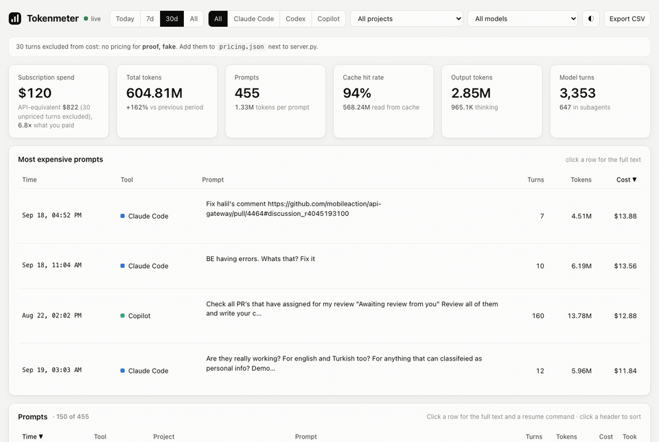

# homebrew-tap



```bash
brew install serkankorkut/tap/tokenmeter
```

Formulae for [Tokenmeter](https://github.com/serkankorkut/tokenmeter), the local token usage and cost dashboard for Claude Code, Codex and Copilot CLI.

Run in the background:

```bash
brew services start tokenmeter
```