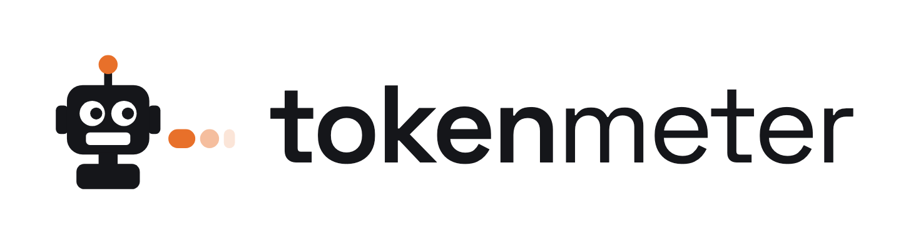
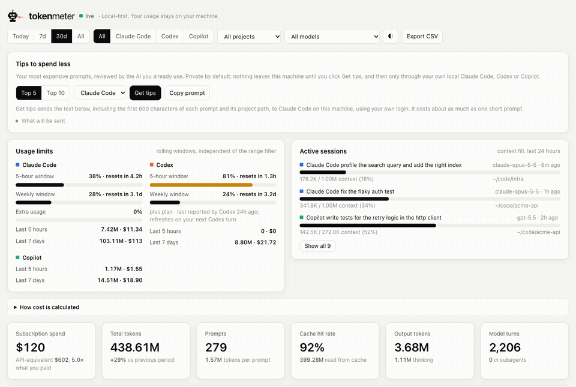

<p align="center">
  <picture>
    <source media="(prefers-color-scheme: dark)" srcset="docs/logo-dark.png">
    
  </picture>
</p>

[](https://github.com/serkankorkut/homebrew-tap/actions/workflows/health.yml) [](https://pypi.org/project/tokenmeter-dashboard/)



A local dashboard that shows token usage, real cost, cache misses and rate-limit windows for every prompt you send in **Claude Code**, **Codex** and **GitHub Copilot CLI**. Zero dependencies: one Python file, one HTML file, nothing leaves your machine.

This repository is the Homebrew tap. The same app is on PyPI as [tokenmeter-dashboard](https://pypi.org/project/tokenmeter-dashboard/) for Windows, Linux and any machine with Python.

[](https://github.com/serkankorkut/homebrew-tap/issues/new/choose) [](mailto:korkutserkan@outlook.com?subject=Tokenmeter)

## Install

### macOS

```bash
brew install serkankorkut/tap/tokenmeter
tokenmeter start
```

`tokenmeter start` runs the dashboard in the background, starts it again at login, and opens http://127.0.0.1:7788 in your browser. Stop it with `tokenmeter stop`. On macOS this is a launchd agent named `fyi.tokenmeter`, on Linux a systemd user service; where neither is available it runs as a plain background process.

### Windows

Needs Python 3.9 or newer from [python.org](https://www.python.org/downloads/) or the Microsoft Store. In PowerShell:

```powershell
py -m pip install --user pipx
py -m pipx ensurepath
pipx install tokenmeter-dashboard
& "$HOME\.local\bin\tokenmeter.exe" start
```

The first start uses the full path because the current terminal does not know about the new PATH yet. Open a new terminal after `ensurepath` so `tokenmeter` is on your PATH. Or run it without installing, using [uv](https://docs.astral.sh/uv/):

```powershell
powershell -ExecutionPolicy ByPass -c "irm https://astral.sh/uv/install.ps1 | iex"
uvx --from tokenmeter-dashboard tokenmeter --open
```

### Linux or any machine with Python

```bash
pipx install tokenmeter-dashboard
pipx ensurepath
~/.local/bin/tokenmeter start
```

`pipx ensurepath` adds `~/.local/bin` to your PATH for new terminals; until you open one, use the full path as above.

Without installing anything permanently:

```bash
uvx --from tokenmeter-dashboard tokenmeter --open
```

Or with plain pip, into whatever environment you like:

```bash
python3 -m pip install tokenmeter-dashboard
python3 -m tokenmeter --open
```

The dashboard is at http://127.0.0.1:7788. `tokenmeter start` runs it in the background and opens it; plain `tokenmeter` runs it in the terminal until you press Ctrl+C.

### Upgrade and uninstall

| Installed with | Upgrade | Uninstall |
|---|---|---|
| Homebrew | `brew update && brew upgrade tokenmeter && tokenmeter start` | `tokenmeter stop && brew uninstall tokenmeter` |
| pipx | `pipx upgrade tokenmeter-dashboard && tokenmeter start` | `tokenmeter stop && pipx uninstall tokenmeter-dashboard` |
| uvx | runs the latest each time | nothing to remove |
| pip | `python3 -m pip install -U tokenmeter-dashboard && tokenmeter start` | `tokenmeter stop && python3 -m pip uninstall tokenmeter-dashboard` |

## If something goes wrong

**Homebrew install failed.** First rule out the usual causes:

```bash
brew update
brew doctor
```

On Intel Macs with the python.org installer's Python, Homebrew may stop with `Could not symlink bin/python3.13`. Let Homebrew's Python take over those links, then install again:

```bash
brew link --overwrite python@3.13
brew reinstall serkankorkut/tap/tokenmeter
```

Intel Macs are a lower support tier in Homebrew, so some dependencies build from source there and the first install can take 15 minutes. Apple Silicon installs in about a minute.

If it still fails, upload the build logs and paste the link it prints into an [install issue](https://github.com/serkankorkut/homebrew-tap/issues/new?template=install-failure.yml):

```bash
brew gist-logs serkankorkut/tap/tokenmeter
```

**pipx, uvx or pip install failed.** Run it again with `--verbose` and paste the last lines and your `python3 --version` into an [install issue](https://github.com/serkankorkut/homebrew-tap/issues/new?template=install-failure.yml).

**It runs but a number looks wrong.** Open a [bug report](https://github.com/serkankorkut/homebrew-tap/issues/new?template=bug.yml) with `tokenmeter --version`.

**Another app already uses port 7788.** Tokenmeter moves to the next free port up to 7798 and prints the address. To pick your own, run `tokenmeter start --port 8765`; it is remembered from then on.

**The page at 127.0.0.1:7788 does not load.** Another copy may still be running from an older version. Stop whatever holds the port, then start again:

```bash
tokenmeter stop
lsof -ti :7788 | xargs kill
tokenmeter start
```

The formula is installed, tested and audited on Apple Silicon, Intel and Linux twice a week, so breakage from Homebrew or Python updates is usually caught before you hit it. The badge at the top shows the latest result.

## What you get

- Live feed of every model turn from Claude Code, Codex and GitHub Copilot CLI, updated a few seconds after each prompt finishes
- Spend tile that shows what you actually pay first (your subscription, prorated to the range) with the API-equivalent cost underneath, or the API cost on top if you have no plan configured
- Tokens split into cached, fresh and output everywhere, because they are priced up to 200 times apart and a plain total hides what you paid for
- Every prompt with its text, the turns it triggered, tokens by type, cost, duration, the arithmetic behind the cost, and a command to resume that session. Click any header to sort by date, tokens, cost, turns or duration
- Usage limits: Codex 5-hour and weekly windows as Codex reports them, plus rolling 5-hour and 7-day usage for every tool
- Active sessions with a context-fill gauge, so you see compaction coming
- Cache-miss detector: turns where the cached context collapsed and had to be re-written, with the prompt that was in progress and what the re-write cost
- Cost per git commit, cost mix by token type, and breakdowns by model, project and session
- Budget alerts: set a daily or monthly cap and get a desktop notification when you cross it
- Team mode: teammates export aggregates to one shared Tokenmeter and you filter by person
- Filters for time range, tool, project, model and user, kept in the URL so views are bookmarkable, plus CSV export and light and dark themes

## How it works

Nothing is installed inside Claude Code, Codex or Copilot. All three already save every conversation to a log file on your disk, and each model reply in that log includes how many tokens it used. Tokenmeter just reads those logs.

1. Claude Code saves logs in `~/.claude/projects/`, Codex in `~/.codex/sessions/`, Copilot CLI in `~/.copilot/session-store.db`. On Windows `~` is your user folder, for example `C:\Users\you`.
2. Tokenmeter reads every log once, pulls out each prompt and each model reply with its token counts, and keeps them in memory.
3. It multiplies each token type by that model's list price to get the cost.
4. It serves a web page at `http://127.0.0.1:7788`. The page asks the server every 4 seconds if anything changed and redraws when it has.

When you send a new prompt, the tool appends to its log, Tokenmeter notices the file grew, re-reads that one file, and the new turn shows up.

## How cost is calculated

```
cost = cached reads × read price
     + uncached input × input price
     + cache writes × write price
     + output × output price      (all per million tokens)
```

On Claude a cached read is about 2 percent of the price of a fresh token, and output is 2 to 5 times a fresh token. That is why a prompt with more tokens can cost less. Claude Code writes its cache at the 1-hour rate; OpenAI does not charge for cache writes. The dashboard shows the rates it used and, under every prompt, the arithmetic for that prompt.

These are API list prices. If you are on a subscription you pay the plan price; the dashboard shows that first and the API-equivalent figure below it.

## Configuration

Create `~/.tokenmeter/config.json` (on Windows `%USERPROFILE%\.tokenmeter\config.json`) with only the keys you want to change. It is merged over the bundled price list at startup, so upgrades never overwrite your settings. Example for someone on the $100 Claude plan and $20 ChatGPT Plus:

```json
{"_plans": {"claude": 100, "codex": 20}, "_budget": {"daily": 30}}
```

| Key | Purpose |
|---|---|
| model prefixes | USD per million tokens: `input`, `cache_read`, `cache_write_5m`, `cache_write_1h`, `output`. Anthropic and OpenAI list prices are included |
| `_plans` | What you pay per month per tool. Drives the Subscription spend tile. Default 0, which shows API-equivalent cost on top |
| `_budget` | `daily` and `monthly` caps in API-equivalent USD. Desktop notification once per period when exceeded, macOS only for now |
| `_context_windows` | Context size by model prefix, for the context-fill gauge |

Flags and environment variables:

| Setting | Default | Purpose |
|---|---|---|
| `--port N` | `7788` | Listen port. With `start` it is saved, so the background service uses it too. Without a saved port, Tokenmeter tries 7788 and, if another app holds it, the next 10 ports |
| `TOKENMETER_PORT` | | Port for this run only |
| `--open` | | Open the browser after starting |
| `--host` | `127.0.0.1` | Bind address. Use `0.0.0.0` only for a team server |
| `--user NAME` | your login | Name shown in team mode |
| `--export URL` | | Push your last 30 days to a team server every hour. Prompt text is never sent |
| `TOKENMETER_TOKEN` | | Shared secret for team ingest |
| `CLAUDE_CONFIG_DIR`, `CODEX_HOME`, `COPILOT_DB` | the tools' defaults | Where each tool keeps its logs |
| `TOKENMETER_DIR` | `~/.tokenmeter` | Where `config.json`, the server log and team data live |

### Limits

Codex writes its 5-hour and weekly quota usage into every session log, so Tokenmeter shows the real percentages and reset times, as of the last Codex turn. Anthropic does not write Claude plan usage to disk. On macOS, if a Claude Code login token is in the keychain, Tokenmeter shows the plan percentage; otherwise, and on Windows and Linux, it shows rolling 5-hour and 7-day totals from the logs.

### Team mode

On a shared machine: `tokenmeter --host 0.0.0.0` with `TOKENMETER_TOKEN` set. On each laptop: `tokenmeter --export http://that-host:7788` with the same token. The shared dashboard gains a user filter. Only token counts, models, project paths and timestamps travel; prompt text stays local.

## API

| Endpoint | Returns |
|---|---|
| `GET /api/usage` | All records, prompts, and metadata as JSON |
| `GET /api/summary` | Today, last 5 hours, month, projection, limits |
| `GET /api/commits` | Recent commits per repo, for cost per commit |
| `GET /api/export.csv?since=ISO` | CSV of records |
| `GET /api/version` | Cheap change token, polled by the page |
| `POST /api/ingest` | Team mode receiver |
| `GET /api/health` | `{"ok": true, "app": "tokenmeter"}` |

## Privacy

Tokenmeter binds to `127.0.0.1`, reads your agents' logs read-only, keeps its index in memory, and sends nothing anywhere. No telemetry, no update check, no account. The only outbound request it can make is to Anthropic's usage endpoint, on macOS, when a Claude Code login token is already in your keychain. Team mode, if you turn it on, posts aggregates without prompt text to the server you name.

## Feedback

[](https://github.com/serkankorkut/homebrew-tap/issues/new/choose) [](mailto:korkutserkan@outlook.com?subject=Tokenmeter)

Questions, ideas or a story about a surprising bill: korkutserkan@outlook.com.

## License

MIT